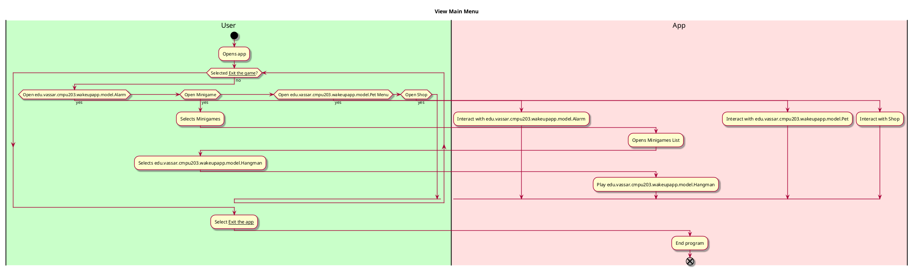

```plantuml
@startuml

skin rose
title View Main Menu

'define swimlanes
|#technology|User|
|#implementation|App|

|User|
start

:Opens app;
while(Selected __Exit the game__?) is (no)
if(Open edu.vassar.cmpu203.wakeupapp.model.Alarm) then (yes)
|App|
:Interact with edu.vassar.cmpu203.wakeupapp.model.Alarm;
|User|
else if(Open Minigame) then (yes)
:Selects Minigames;
|App|
:Opens Minigames List;
|User|
:Selects edu.vassar.cmpu203.wakeupapp.model.Hangman;
|App|
:Play edu.vassar.cmpu203.wakeupapp.model.Hangman;

|User|
else if(Open edu.vassar.cmpu203.wakeupapp.model.Pet Menu) then (yes)
|App|
:Interact with edu.vassar.cmpu203.wakeupapp.model.Pet;
|User|
else if(Open Shop) then (yes)
|App|
:Interact with Shop;
endif
endwhile
|User|
:Select __Exit the app__;
|App|
:End program;
end
```