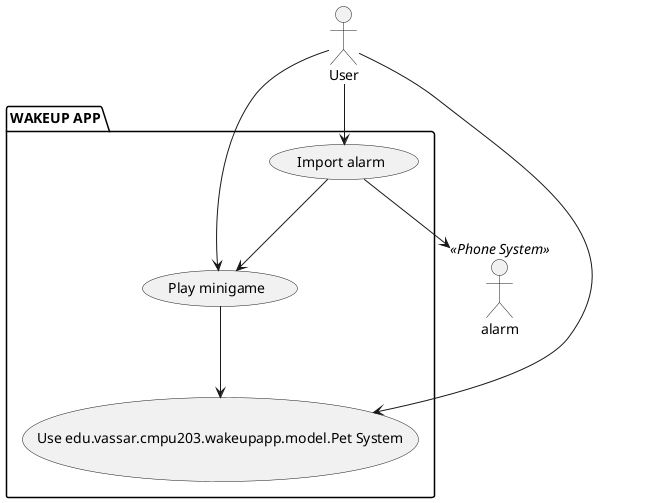

# Vision:

_Defines target audience and value proposition for that audience is. Main features and constraints should be described. Should include a list of goals for each actor and a UML use case diagram. Should be kept short - not much longer than 2 letter-sized pages, when printed._

The main purpose of the app is to have an app where people who have trouble waking up are basically forced to play a edu.vassar.cmpu203.wakeupapp.controller.game on the app.

The 3 main features of the app are as follow:
1) edu.vassar.cmpu203.wakeupapp.model.Alarm: When you first download the app, it will ask for permissions to access your alarm app, connecting all of your alarms and allowing the option to launch a edu.vassar.cmpu203.wakeupapp.controller.game (while simultaneously making sound/vibrating), instead of playing just a sound, snooze button, or vibrate. edu.vassar.cmpu203.wakeupapp.model.Alarm turns off after 5 minutes, but user may be able to change the length. 
2) edu.vassar.cmpu203.wakeupapp.model.Pet: This tracks your streaks while also allowing the user to customize it with clothes and skins (Feature primarily for the end edu.vassar.cmpu203.wakeupapp.controller.game). It would lose health until it dies if you ignore the edu.vassar.cmpu203.wakeupapp.controller.game. Health is added back if you continue your streak.
3) Minigame: A simple edu.vassar.cmpu203.wakeupapp.controller.game that the user must play to turn off the alarm. We plan the first implemented edu.vassar.cmpu203.wakeupapp.controller.game to be hangman.

